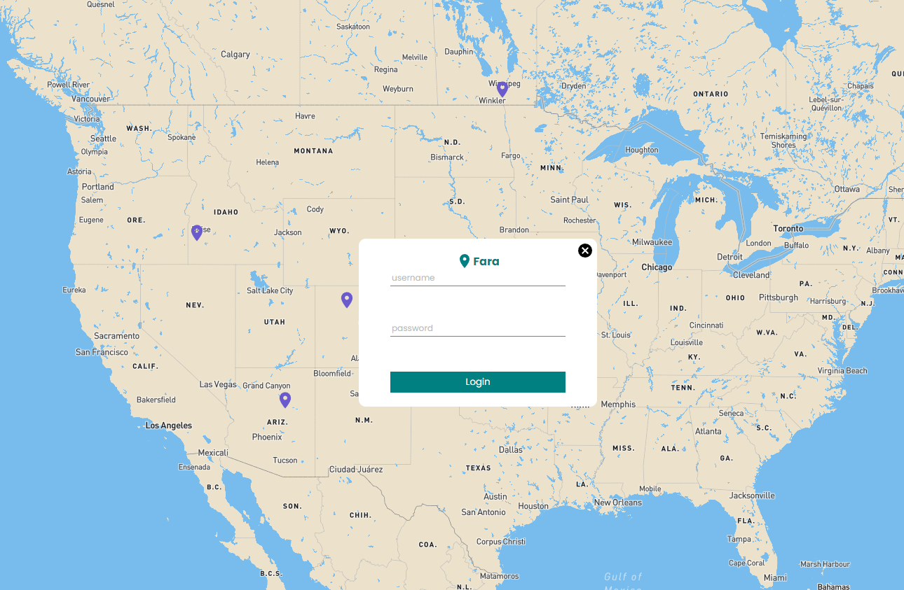

# Fara


## Description

This is a MERN stack application that allows a user to register an account, login, and click a map to review a place that they have been. They can also view other users pins and reviews in order to help decide where to go!

## Table of Contents

- [Visual Example and Deployed Application](#visual-example)
- [Installation & Usage](#installation)
- [My Inspiration](#inspiration)
- [Future Development](#future-development)
- [Technologies Used](#technologies)
- [Resources](#resources)
- [Questions](#questions)

## Visual Example 



Live URL: https://fara-travel.herokuapp.com/

## Installation

1. Fork the repo
2. Clone the repo from your github
3. Install NPM packages
  ```npm install```
5. Make sure to create a .env file using the .env.EXAMPLE as the boiler plate
6. ```npm run develop``` will start the server. Please visit localhost:3000 in order to view the webpage/game visually. The GraphQL Playground and api can be accesed via localhost:3001. Please feel free to change the port number if this would conflict with any personal items running locally on your machine. 

## Inspiration

My inspiration was from my wife! We both love to travel, and having a nice, clean, and simple to use application where we could see where other people have gone and their reviews would be very nice! I decided to put my development skills to the test and make this application solo. 

## Future Development
```
A user page that displays all pins they have placed
A way to comment on someone elses pins and ask questions, or let them know their review was helpful
A chat/mail system for users to contact each other directly
```
## Technologies

<div style='margin: 1em 0;'>


## Resources
```
- MongoDB
- Express
- ReactJS
- NodeJS
- Javascript/JSX
- CSS
- Apollo Server
- GraphQL
- ReactJS
- React Map Gl
- Stripe
```

## Questions
Any questions please contact me at <nathanflessner1@gmail.com> or at my [Github](https://github.com/SirNathanJF)
